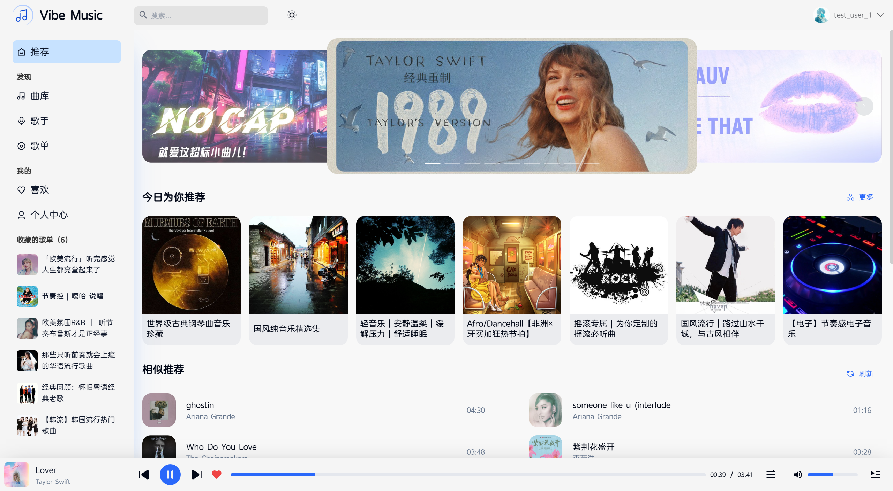
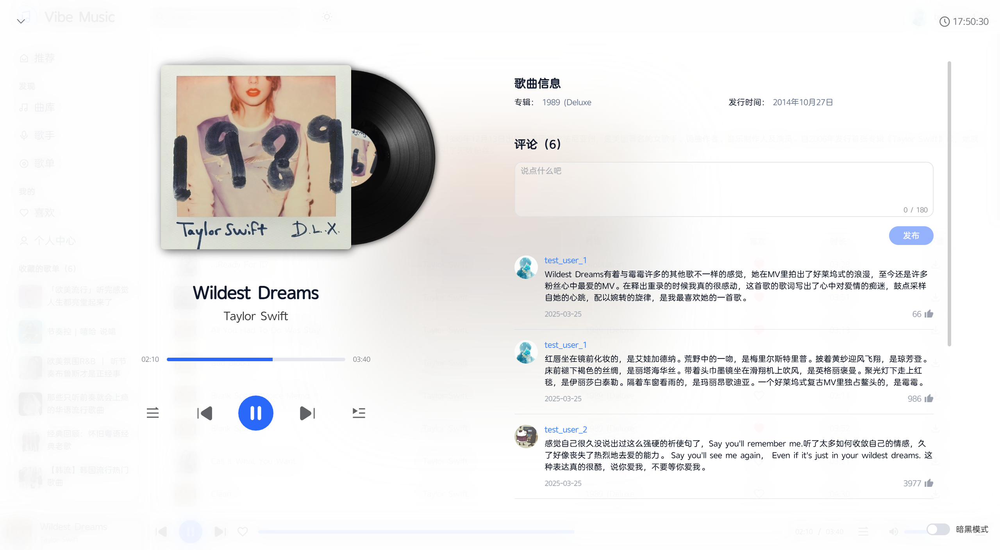
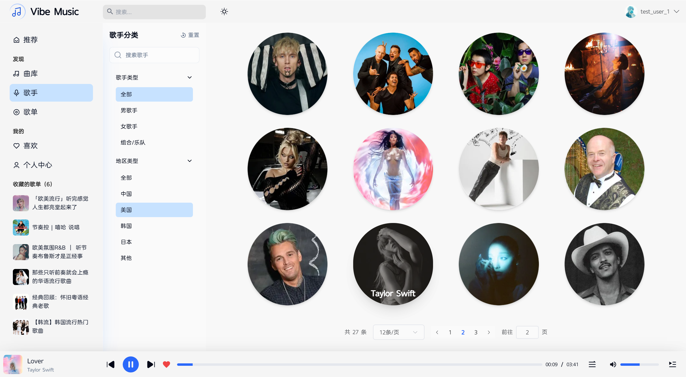
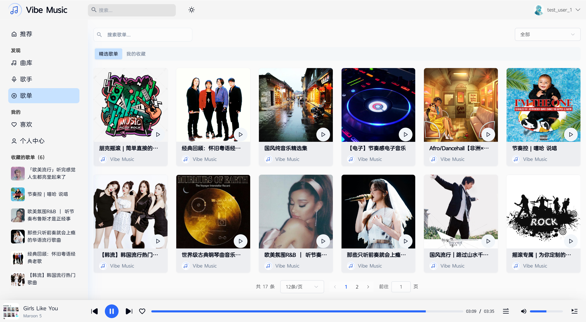
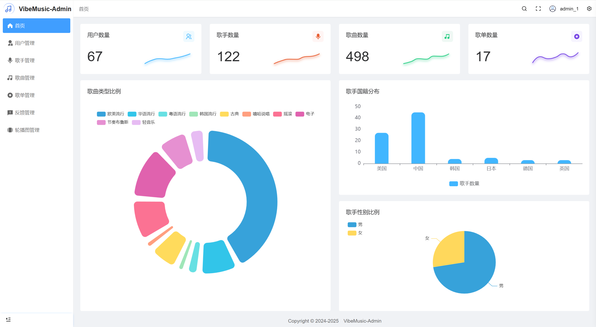
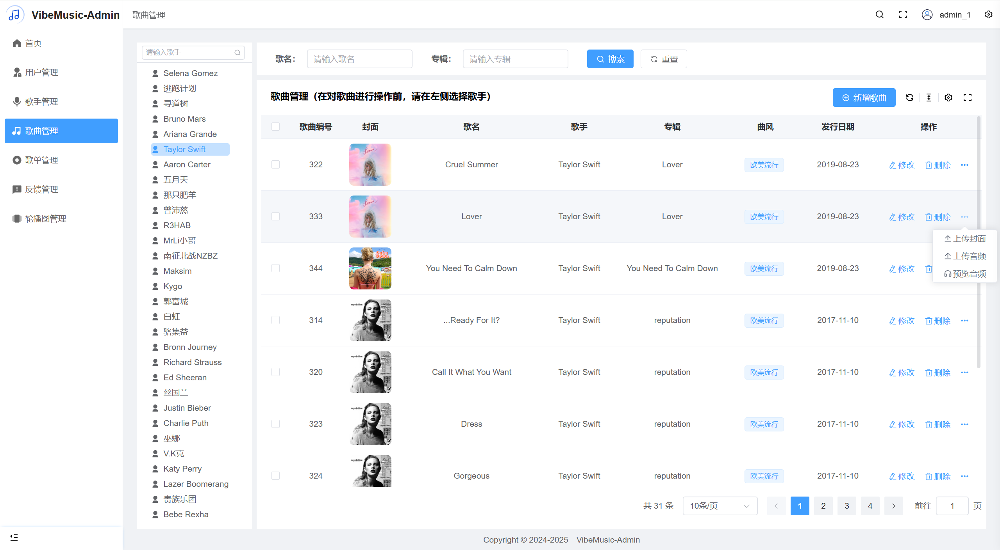
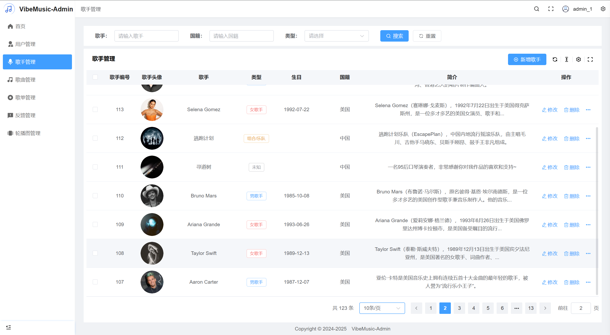
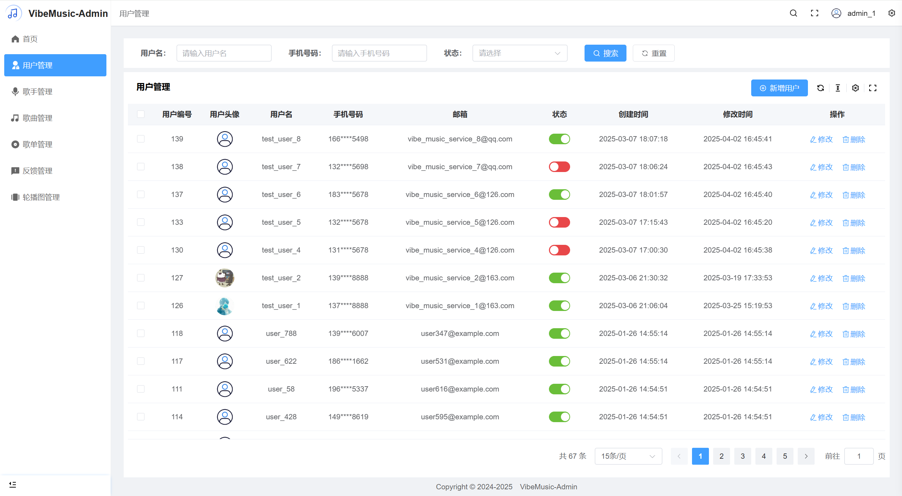

# Simple Music (Vibe Music) 🎵

<p align="center">
  <strong>现代化全栈流媒体音乐播放与综合管理平台</strong>
</p>

<p align="center">
  
  
  
  
  
  
  
  
  
</p>

---

## 📖 项目简介

**Simple Music**（又名 **Vibe Music**）是一个基于现代化技术栈构建的**全栈云音乐流媒体系统**。系统由**用户端 Web 应用**、**后台管理系统**、**高性能后端 API 服务**及**Docker 容器化部署套件**组成，提供从音乐在线播放、动态歌词同步、歌单歌手发现，到后台资源维护、数据看板分析的全流程解决方案。

### 🌟 核心子项目

- **🎵 用户端 (Client)**：基于 Vue 3 + Vite + Tailwind CSS + Pinia 构建，界面优雅，支持暗黑模式、流畅播放器交互、逐行歌词滚动、个性化推荐与互动评论。
- **💻 管理端 (Admin)**：基于 Vue 3 + Pure Admin 架构，提供歌手、歌曲、歌单、首页轮播、用户权限及用户反馈的全功能可视化运维管理。
- **⚙️ 服务端 (Server)**：基于 Spring Boot 3 + MyBatis-Plus + Java 17，集成 JWT 无状态认证、Redis 缓存加速、MinIO 分布式对象存储与 Druid 连接池。
- **🐳 容器化 (Docker)**：提供一键式 `docker-compose` 编排配置与 Nginx 生产反向代理，支持一键部署上线。

---

## 📸 界面预览

### 用户端（Client）
| 音乐首页推荐 | 歌曲沉浸式播放 |
| :---: | :---: |
|  |  |
| **歌手浏览与详情** | **歌单探索与评论** |
|  |  |

### 管理端（Admin）
| 仪表盘数据看板 | 歌曲资源管理 |
| :---: | :---: |
|  |  |
| **歌手资料库维护** | **系统用户权限管理** |
|  |  |

---

## 🛠️ 技术选型

| 领域 | 核心技术 | 说明 |
| :--- | :--- | :--- |
| **后端框架** | Spring Boot 3.3.7 + Java 17 | 核心业务与 RESTful API 服务 |
| **数据持久层** | MyBatis-Plus 3.5.x | ORM 数据库访问框架与分页插件 |
| **数据库** | MySQL 8.0 | 主关系型数据库 |
| **分布式缓存** | Redis 7.x | 热点数据缓存、会话与限流支持 |
| **对象存储** | MinIO | 音频流媒体文件、专辑封面及头像云存储 |
| **安全鉴权** | JWT (JSON Web Token) | 前后端分离无状态令牌鉴权与角色拦截器 |
| **客户端前端** | Vue 3 + Vite 5 + Pinia + Tailwind CSS | 响应式现代化 Web 音乐播放客户端 |
| **管理端前端** | Vue 3 + Pure Admin + Element Plus | 企业级后台中台脚手架与 ECharts 可视化 |
| **网关与代理** | Nginx Alpine | 静态资源代理与前后端跨域路由反代 |
| **容器编排** | Docker & Docker Compose | 全服务多容器一键编排与部署 |

---

## 📂 项目结构

```text
simple-music/
├── simple-music-server-main/     # [后端] Spring Boot 3 服务端工程
│   ├── src/main/java/            # 后端核心业务源码 (Controller, Service, Mapper, Model)
│   ├── src/main/resources/       # 配置文件 (application.yml, MyBatis XML)
│   └── pom.xml                   # Maven 构建配置
│
├── vibe-music-client-main/       # [前端] 用户端 Web 播放器
│   ├── src/pages/                # 页面视图 (播放、歌单、歌手、排行榜、个人中心)
│   ├── src/components/           # 通用组件 (音频播放器、歌词组件、导航栏)
│   ├── src/stores/               # Pinia 状态管理
│   └── package.json
│
├── vibe-music-admin-main/        # [前端] 管理端后台运营系统
│   ├── src/views/                # 业务管理视图 (用户、歌曲、歌手、歌单、轮播图)
│   ├── src/router/               # 动态路由与鉴权
│   └── package.json
│
├── docker/                       # [运维] 容器化编排套件
│   ├── docker-compose.yml        # Docker Compose 完整编排文件
│   ├── .env.example              # 环境变量配置模板
│   └── 容器化部署指南.md          # 容器化专属部署及填坑手册
│
├── Vibe Music Admin API 接口文档.md  # 详细 RESTful API 接口规范
├── .gitignore                    # 生产级代码与敏感数据忽略过滤配置
└── README.md                     # 本项目技术文档
```

---

## ✨ 主要功能清单

### 1. 🎵 客户端（Vibe Music Client）
- **播放控制**：播放/暂停、快进/快退、切歌、播放模式（顺序/单曲循环/随机）、音量控制。
- **歌词同步**：实时 LRC 歌词解析高亮并跟随播放进度平滑滚动。
- **音乐探索**：
  - 推荐歌单、热门歌曲榜单、分类音乐库。
  - 歌手详情页（歌手简介、单曲作品、所属专辑）。
- **用户体系**：注册、登录、个人信息修改、头像上传剪裁。
- **互动收藏**：一键收藏喜爱歌曲、歌单；歌曲与歌单评论发表与点赞。
- **主题外观**：支持暗黑模式与明亮模式无缝切换。

### 2. 💻 管理端（Vibe Music Admin）
- **数据看板**：实时汇总展示平台用户总数、歌曲总数、播放量趋势及近期活跃度。
- **歌曲管理**：歌曲信息录入（歌名、歌手、风格、时长）、音频文件上传至 MinIO、在线试听、下架/删除。
- **歌手管理**：歌手新增、照片剪裁上传、所属地区/性别/风格标签维护。
- **歌单管理**：官方推荐歌单创建、封面设定、关联歌曲批量编排。
- **轮播运营**：首页轮播 Banner 图配置、跳转跳转类型与链接设定。
- **用户与反馈**：注册用户状态监控（正常/封禁）、用户问题反馈跟进。

---

## 🚀 快速启动指南

您可以根据使用场景选择 **Docker Compose 一键部署（推荐）** 或 **本地开发调试启动**：

### 选项 A：使用 Docker Compose 一键部署（推荐）

#### 1. 前置要求
- 已安装 [Docker](https://docs.docker.com/get-docker/) (>= 24.0) 及 [Docker Compose](https://docs.docker.com/compose/) (>= v2)

#### 2. 配置环境变量
进入 `docker/` 目录，从模板复制环境变量配置文件：
```bash
cd docker
cp .env.example .env
```
根据实际需求修改 `.env`（如自定义 MySQL 密码、MinIO 访问密钥等）。

#### 3. 启动全栈容器集群
```bash
# 后台构建并启动全部服务 (MySQL, Redis, Backend, Admin, Client)
docker compose up -d --build
```

#### 4. 初始化数据库数据
若首次启动，将 SQL 初始化脚本导入 MySQL 容器：
```bash
# 导入基础表结构及种子数据
docker exec -i mysql mysql -uroot -p123456 vibe_music < music-server-main/sql/vibe_music.sql
```

---

### 选项 B：本地开发环境启动

#### 1. 前置准备
- **JDK**：`17` 或更高版本
- **Node.js**：`>= 18.18.0`，推荐使用 `pnpm` (`npm i -g pnpm`)
- **MySQL**：`8.0+`（创建数据库 `vibe_music` 并执行 `docker/music-server-main/sql/vibe_music.sql`）
- **Redis**：`6.0+` 或 `7.x`
- **MinIO**：已安装并创建 Bucket：`vibe-music-data`（设置为 Public 读权限）

#### 2. 启动后端服务
```bash
cd simple-music-server-main

# 检查 src/main/resources/application.yml 中的 MySQL、Redis、MinIO 连接信息
# 启动 Spring Boot 服务
mvn spring-boot:run
```
后端服务默认启动在：`http://localhost:9080`

#### 3. 启动管理端前端
```bash
cd vibe-music-admin-main
pnpm install
pnpm dev
```
管理端前台访问地址：`http://localhost:8089`

#### 4. 启动客户端前端
```bash
cd vibe-music-client-main
pnpm install
pnpm dev
```
用户端前台访问地址：`http://localhost:5173`

---

## 🌐 常用服务与端口映射

| 服务名称 | 默认本地端口 | Docker 映射端口 | 默认访问地址 / 备注 |
| :--- | :--- | :--- | :--- |
| **客户端 (Client)** | `5173` | `3001` | [http://localhost:3001](http://localhost:3001) |
| **管理端 (Admin)** | `8089` | `3000` | [http://localhost:3000](http://localhost:3000) |
| **后端 API (Server)** | `9080` | `8080` | [http://localhost:8080](http://localhost:8080) |
| **MySQL 数据库** | `3306` | `3307` | 默认库名：`vibe_music` |
| **Redis 缓存** | `6379` | `6379` | - |
| **MinIO 存储控制台** | `9001` | `9001` | 默认账号密码：`minioadmin / minioadmin` |

> 🔑 **默认管理端测试登录账号**：
> - 用户名：`admin_1`
> - 密码：`123456abc`

---

## 📄 开源许可证

本项目基于 [MIT License](LICENSE) 开源协议，欢迎学习交流、提交 Issue 与 Pull Request！
